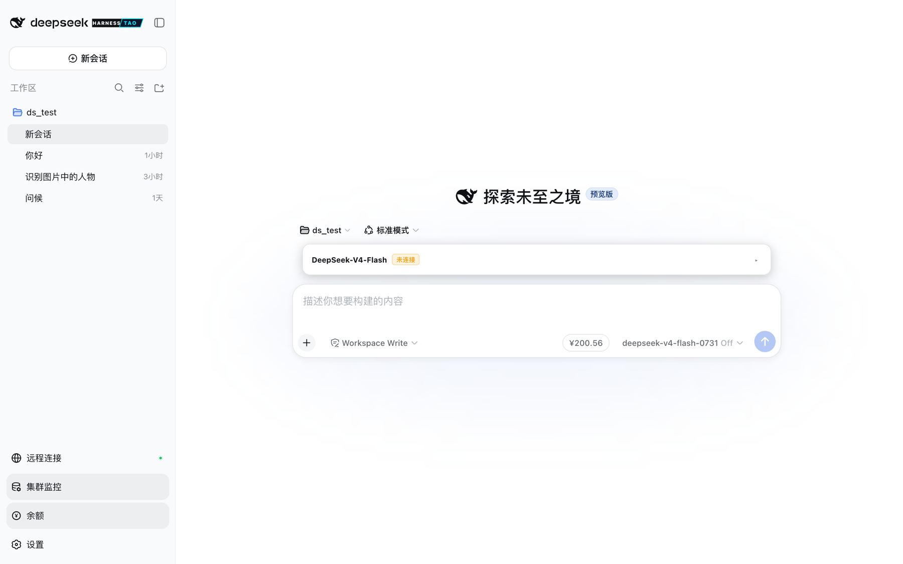
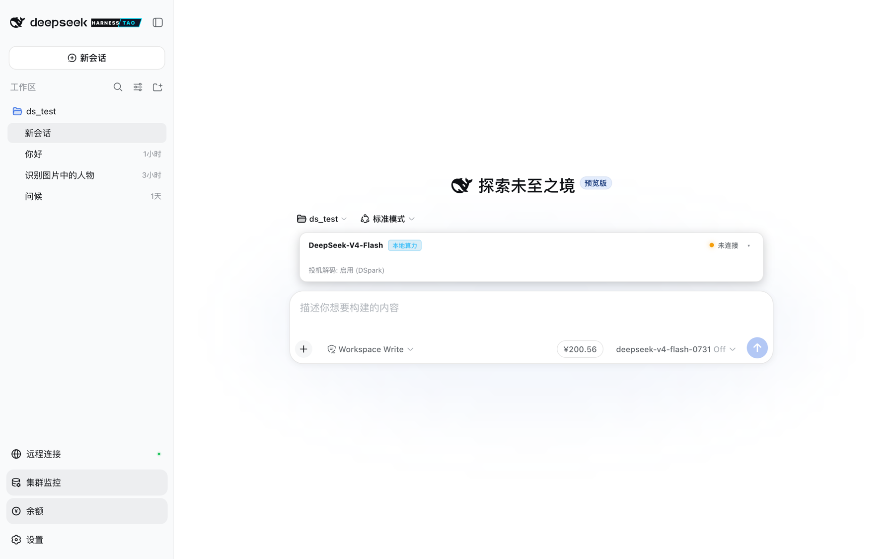
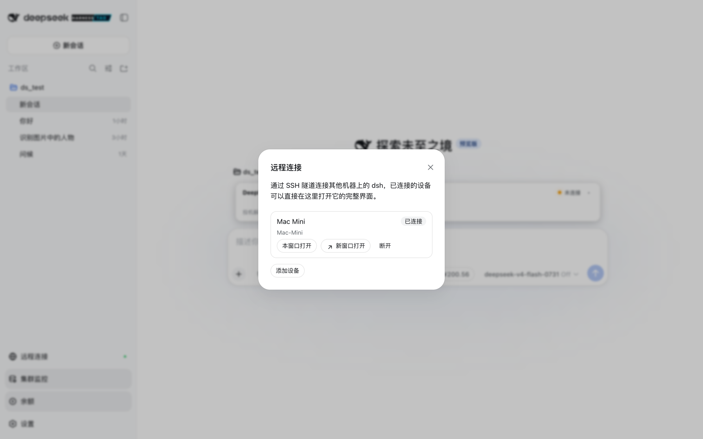
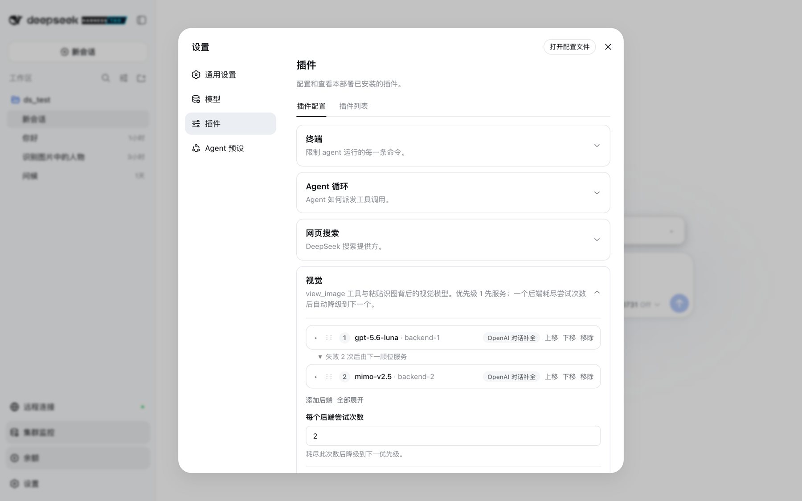
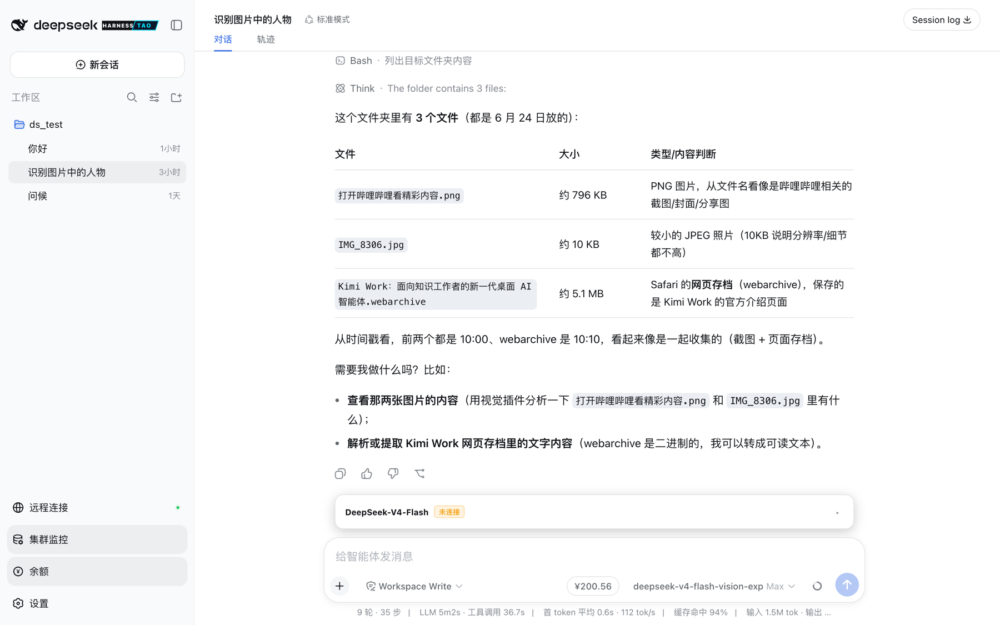
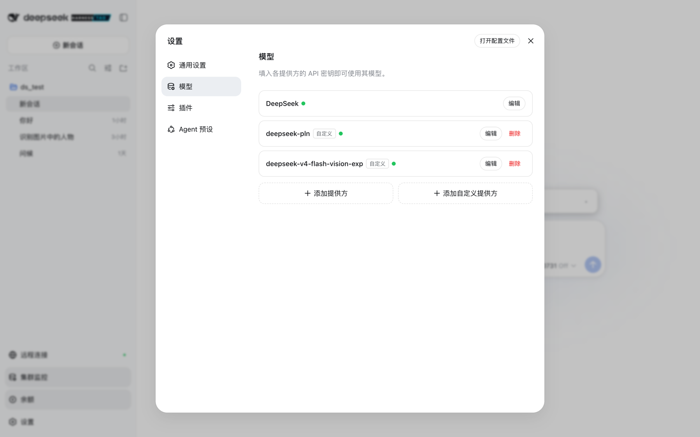
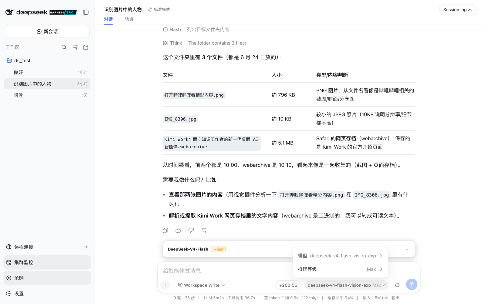

# DeepSeek Harness

[English](README.md) | 中文

本仓库是一份工作 [fork](https://github.com/taotaoxu7447/deepseek-harness)，源自 [DeepSeek AI](https://deepseek.com) 的开源 agent harness（智能体框架）（`dsh`）。官方产品在 [`deepseek-ai/deepseek-harness`](https://github.com/deepseek-ai/deepseek-harness)。本 checkout 跟踪该上游树，并加上本 fork 日常使用的插件：V4 Flash 集群监控、官方 API 余额胶囊、SSH 远程设备、给纯文本路由用的视觉 sidecar、自定义模型推理控制，以及原生桌面外壳。

它采用**一切皆插件**的架构，并由 [Cordis](https://github.com/cordiverse/cordis) 驱动，其设计参见论文 [_A Programming Paradigm for Spatiotemporal Composability_](https://github.com/cordiverse/paper)。

这不是 DeepSeek 的官方发行版，也不代表 DeepSeek 发言。已发布的 npm 包 `@deepseek-ai/dsh` 才是官方产品，不含本 fork 的插件。



## 本 checkout 与官方仓库

两棵树共用同一套 Web UI、插件架构、CLI 和 agent loop（智能体循环）。官方 README 只写到如何运行那份产品。本 checkout 多出来的界面，就是下表这些插件。

| 范围 | 官方仓库 | 本 checkout |
|---|---|---|
| Web UI、插件架构、CLI | 提供 | 基于同一上游提供 |
| V4 Flash 集群监控 | 无 | 输入框状态条 + 侧栏开关 |
| 官方 API 余额 | 无 | 模型选择器旁的胶囊 |
| SSH 远程设备 | 无 | 设置名册、侧栏入口、macOS 辅助窗口 |
| 纯文本路由上的视觉 | 无 | `view_image` sidecar 链 |
| 自定义模型推理、流空闲超时、图像输入 | 仅 YAML / 目录 | 模型页 + 选择器 |
| 原生桌面外壳 | 无 | macOS 应用 + Linux GTK 外壳 |
| 一条命令完成 checkout 引导 | 无 | `./scripts/setup.sh` + 随仓库分发的 PLN overlay |

## 本 checkout 新增的功能

### 主界面

侧栏品牌行使用本 checkout 的字标和切角 `TAO` 徽标。其下、设置上方有三个底部动作：

- **远程连接** — 通过 SSH 连到另一台机器上的 `dsh`。
- **集群监控** — 打开或关闭输入框上方的 V4 Flash 状态条。
- **余额** — 打开或关闭官方 DeepSeek API 余额胶囊。

输入框保留官方的工作区 / 权限 / 模型控件，并在模型选择器左侧加上余额胶囊。已连接的远程设备会在该底部动作上画一颗状态点。

### V4 Flash 集群监控



[`dsh-client-ui-v4-monitor`](packages/client/ui-v4-monitor/README.zh.md) 挂在 `conversation.input.dock`。它不绑定会话模型：侧栏按钮随时可开可关。

当设置 → 插件 → 本地算力监控里存有 Local V4 邀请码时，状态条轮询实时 slot 状态（空闲 / 预填 / 生成、上下文占用、投机解码、最近任务）。没有邀请码时状态条仍可见，并报告未连接。详情见 Host 插件 [`dsh-remote-v4-monitor`](packages/remote/v4-monitor/README.zh.md)。

### 官方 API 余额

[`dsh-client-ui-deepseek-balance`](packages/client/ui-deepseek-balance/README.zh.md) 在 Host 上读取已经配置好的官方 DeepSeek 密钥，把剩余额度渲染成模型选择器旁的胶囊。浏览器包看不到密钥。

胶囊跟随官方 DeepSeek 账户，不是 PLN 或自定义网关。显示期间通过 Host RPC 每 60 秒刷新一次。Host 一侧是 [`dsh-remote-deepseek-balance`](packages/remote/deepseek-balance/README.zh.md)。

### 通过 SSH 连接远程机器



[`dsh-remote-tunnels`](packages/remote/remote-tunnels/README.zh.md) 为每台已配置设备保持一条 `ssh -N -L` 本地转发。认证留在你的 `~/.ssh/config`（BatchMode、无密码提示、主机密钥事先受信任）。就绪设备是 `http://127.0.0.1:<localPort>/` — 远程 Host 提供自己的 UI，在那里发消息走远程 agent loop。

[`dsh-client-ui-remote`](packages/client/ui-remote/README.zh.md) 是主界面上的「连接并打开」路径，已配置的设备不必绕道设置页：

- **本窗口打开** 把隧道 UI 摆进当前窗口。
- **新窗口打开** 在新浏览上下文打开隧道 URL。普通浏览器得到一个标签页；macOS 外壳把它路由进带标题的辅助窗口。

在设置 → 插件 → 远程设备里添加或编辑名册。`autoConnect` 会在该行出现后立刻拉起设备。

### Vision sidecar



官方 DeepSeek chat-completions 路由是纯文本。本 checkout 增加视觉能力 seam，让纯文本主模型仍能处理图像：

1. 在纯文本路由上粘贴或拖放时，图像被存下来，并记成一条 `view_image` 指针（文件名、大小、`attachment_id`），而不是内联图像块。
2. 主模型需要描述时调用 [`view_image`](packages/vision/tool-vision/README.zh.md)。
3. [`dsh-vision-qwen`](packages/vision/vision-qwen/README.zh.md) 按优先级跑 OpenAI Chat、OpenAI Responses 或 Anthropic 后端。第一个可用的后端提供服务；耗尽尝试次数后降到下一个。

在设置 → 插件 → 视觉里配置这条链。拖动行即可改序。每一行指定协议和 effort 预设（`openai`、`mimo`、`qwen-local`、`anthropic`）。键入的密钥只写不读。



在 macOS 外壳下，拖入的文件夹或非图像文件会变成绝对路径提及。在浏览器里，拖入的文件夹只遍历可附加的图像。见 [`dsh-client-ui-attachment`](packages/client/ui-attachment/README.zh.md) 和 [`dsh-vision`](packages/vision/vision/README.zh.md)。

### 自定义模型与推理等级



官方模型页只保存 DeepSeek 密钥。本 checkout 的模型页还可以在 UI 里编辑 pi-ai 路由：

- 添加目录提供方或手写自定义提供方
- 用当前表单上的 URL 和密钥请求 `/models`
- 为每个模型设置上下文窗口、输出上限和 `reasoningEfforts` 档位（`off` / `high` / `max`，或提供方预设）
- 设置该路由的流空闲超时（本地模型长时间不出字时，客户端在放弃前等待的静默秒数）
- 对真正接受图像的自定义模型声明 `input: [text, image]`



选择器列出每条已配置路由，以及当前模型声明的推理等级。已经发过请求的会话沿用自己日志里记录的模型。PLN 路由的团队默认值在 [`deploy/defaults.patch.yml`](deploy/defaults.patch.yml)，每次 `dsh` 启动都会应用；用户设置仍然优先。不要把 API 密钥写进那个文件。详情见[配置模型](docs/user/guide/providers.zh.md)。

### 原生桌面外壳

本 checkout 为 `http://127.0.0.1:3080/` 提供两个桌面包装层：

- **macOS** — `scripts/macos-app` 构建 `DeepSeek Harness.app`（WKWebView、经 `WKDownload` 的 Downloads、远程设备的独立辅助窗口、网页服务器构建新于当前窗口时的重启提示）。
- **Linux** — [`scripts/linux-app`](scripts/linux-app/README.zh.md) 是 GTK 4 + WebKitGTK 窗口，同样会自动拉起 `dsh web`。`./scripts/setup.sh` 之后可用 `dsh app` 启动。

关闭窗口不会停掉 Web 服务器。之后再启动时，若 `127.0.0.1:3080` 已在应答就会复用它。

### Checkout 引导

`./scripts/setup.sh` 安装依赖、构建本树、把 `dsh` 放到 `PATH`、在不覆盖已有文件的前提下写入 `~/.dsh/.credentials.yaml`，并在 Linux 上安装桌面启动器。之后更新：`./scripts/setup.sh --update`。

密钥只放在 `~/.dsh/.credentials.yaml`。包装脚本始终启动本 checkout，因此 `dsh web` / `dsh app` 会带上视觉、远程设备和随仓库分发的 PLN overlay。`npx @deepseek-ai/dsh` 不会。

## 开发者预览

DeepSeek Harness 目前处于 _开发者预览_ 阶段，正在快速迭代。**未来将出现破坏兼容性的变更。**

<a id="run"></a>

## 运行

### 运行本检出目录

```sh
git clone https://github.com/taotaoxu7447/deepseek-harness.git
cd deepseek-harness
./scripts/setup.sh
```

然后可在任意目录运行：

```sh
dsh web
dsh app
dsh --help
```

把 `~/.dsh/.credentials.yaml` 里的 `DEEPSEEK_API_KEY` 和 `DEEPSEEK_PLN_API_KEY` 填一次即可。之后更新：

```sh
./scripts/setup.sh --update
```

团队默认值（提供方路由、默认模型、effort 档位）在 [`deploy/defaults.patch.yml`](deploy/defaults.patch.yml)，每次 `dsh` 启动都会应用。要改所有 clone 拿到的默认值，请改这个文件并提交；不要把 API 密钥写进去。

### 通过 `npm` 运行

安装 `Node.js`，然后运行：

```sh
npx @deepseek-ai/dsh web
```

该命令默认会在 `http://127.0.0.1:3080` 启动官方 Web UI，本机启动时还会用默认浏览器打开页面。通过 SSH 启动时只打印宿主机 URL，因为本地转发地址由 SSH 客户端或编辑器持有。传入 `--no-open` 可仅运行服务器而不打开浏览器。详见 [Web UI 指南](docs/user/guide/index.zh.md)。已发布的 npm 包不包含本 fork 的视觉插件、远程设备、集群监控、余额胶囊或自定义 PLN 路由。

<a id="run-from-source"></a>

### 从源码运行

如需从仓库源码运行、且不使用引导脚本：

```sh
git clone https://github.com/taotaoxu7447/deepseek-harness.git
cd deepseek-harness
pnpm install
pnpm run build
pnpm dsh web
```

`pnpm run build` 会准备仓库产物。`pnpm dsh web` 会直接使用这些已构建产物，不会重新构建。

## 社区与支持

- 欢迎通过官方仓库的 [GitHub Discussions](https://github.com/deepseek-ai/deepseek-harness/discussions) 提交反馈或 bug 报告。
- 为你的插件仓库添加 [`dsh-plugin`](https://github.com/topics/dsh-plugin) 话题，便于被发现。
- 欢迎加入 <a href="https://discord.gg/Ycq5dCaS4">DeepSeek Harness Discord community</a>。

只属于本 fork 的问题请开到 [`taotaoxu7447/deepseek-harness`](https://github.com/taotaoxu7447/deepseek-harness/issues)。

## 参与贡献

参见 [CONTRIBUTING.md](CONTRIBUTING.zh.md)。

## 开发

请先阅读[开发指南](docs/development.zh.md)与[架构文档](docs/architecture.zh.md)。

面向 agent：请遵循 [AGENTS.md](AGENTS.md)。

## 许可证

[MIT](LICENSE)

第三方依赖及其许可证见 [THIRD_PARTY_NOTICES.md](THIRD_PARTY_NOTICES.md)。
